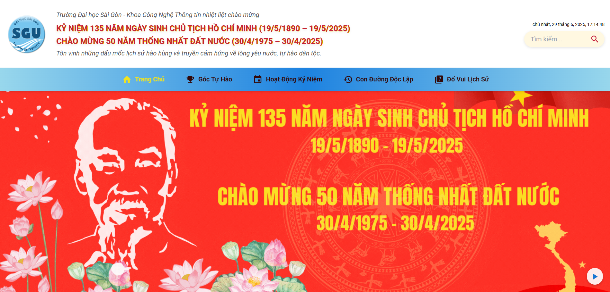
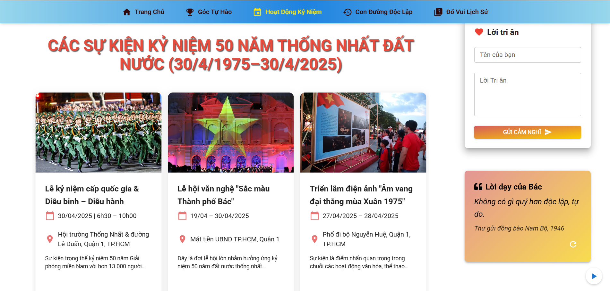
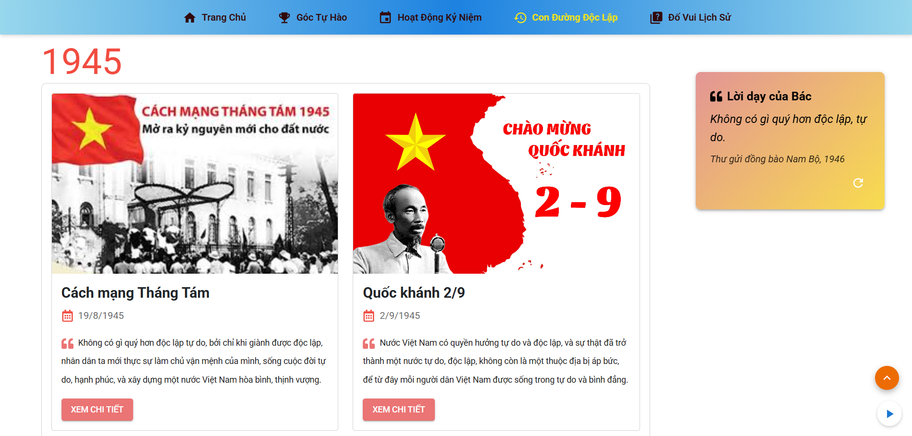
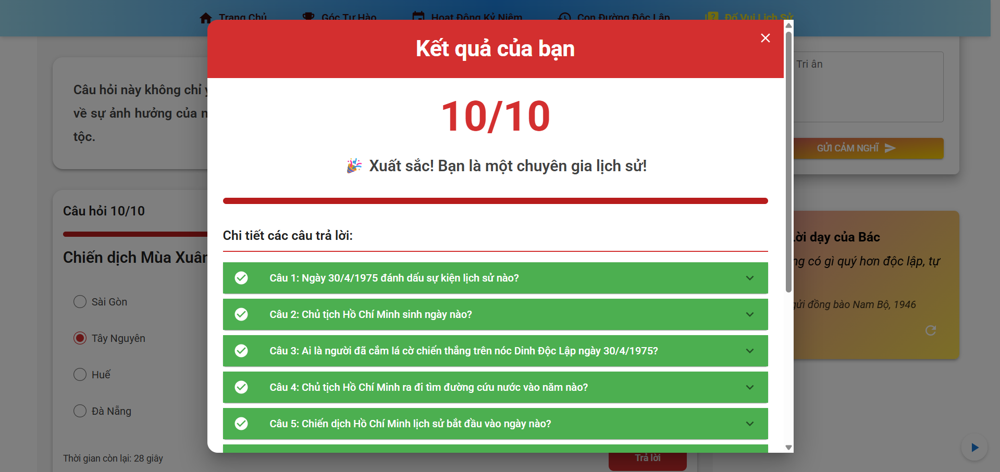

# Website Kỷ niệm 50 năm Giải phóng miền Nam và 135 năm ngày sinh Chủ tịch Hồ Chí Minh

🌐 **Link Website**: [https://ky-niem-135-ho-chi-minh-50-nam-giai.vercel.app](https://ky-niem-135-ho-chi-minh-50-nam-giai.vercel.app)

  <h2>🌐 Link Website: <a href="https://ky-niem-135-ho-chi-minh-50-nam-giai.vercel.app/">https://ky-niem-135-ho-chi-minh-50-nam-giai.vercel.app/</a></h2>

## 📸 Giao diện

### Trang Chủ

### Góc Tự Hào

### Hoạt động kỷ niệm

### Con đường độc lập

### Đố vui lịch sử

## ✨ Tính năng

<table style="width: 100%; border-collapse: collapse;">
<tr style="background-color: #e9ecef;">
<th style="padding: 12px; text-align: left; border-bottom: 2px solid #dee2e6;">Tính năng</th>
<th style="padding: 12px; text-align: left; border-bottom: 2px solid #dee2e6;">Mô tả</th>
</tr>
<tr>
<td style="padding: 12px; border-bottom: 1px solid #dee2e6;">🎨 Giao diện</td>
<td style="padding: 12px; border-bottom: 1px solid #dee2e6;">Thiết kế hiện đại, responsive trên mọi thiết bị (Mobile, Tablet, Desktop)</td>
</tr>
<tr>
<td style="padding: 12px; border-bottom: 1px solid #dee2e6;">📸 Trình chiếu</td>
<td style="padding: 12px; border-bottom: 1px solid #dee2e6;">Slider hình ảnh và video tư liệu lịch sử với hiệu ứng chuyển động mượt mà</td>
</tr>
<tr>
<td style="padding: 12px; border-bottom: 1px solid #dee2e6;">📅 Timeline</td>
<td style="padding: 12px; border-bottom: 1px solid #dee2e6;">Các mốc thời gian quan trọng trong cuộc đời Chủ tịch Hồ Chí Minh và lịch sử giải phóng miền Nam</td>
</tr>
<tr>
<td style="padding: 12px; border-bottom: 1px solid #dee2e6;">🎵 Âm thanh</td>
<td style="padding: 12px; border-bottom: 1px solid #dee2e6;">Nhạc nền và âm thanh tư liệu lịch sử, có thể tắt/bật</td>
</tr>
<tr>
<td style="padding: 12px; border-bottom: 1px solid #dee2e6;">🎮 Tương tác</td>
<td style="padding: 12px; border-bottom: 1px solid #dee2e6;">Modal chi tiết sự kiện, hiệu ứng chuyển động mượt mà với Framer Motion</td>
</tr>
<tr>
<td style="padding: 12px; border-bottom: 1px solid #dee2e6;">🔍 Đố vui lịch sử</td>
<td style="padding: 12px; border-bottom: 1px solid #dee2e6;">Trắc nghiệm kiến thức lịch sử về Chủ tịch Hồ Chí Minh và sự kiện giải phóng miền Nam</td>
</tr>
<tr>
<td style="padding: 12px; border-bottom: 1px solid #dee2e6;">📝 Góp ý</td>
<td style="padding: 12px; border-bottom: 1px solid #dee2e6;">Form để lại lời nhắn, góp ý và lời chúc tốt đẹp</td>
</tr>
<tr>
<td style="padding: 12px; border-bottom: 1px solid #dee2e6;">🌐 Đa ngôn ngữ</td>
<td style="padding: 12px; border-bottom: 1px solid #dee2e6;">Hỗ trợ tiếng Việt và tiếng Anh</td>
</tr>
</table>

## 🛠️ Công nghệ sử dụng

- **Frontend Framework**: React JS
- **UI Framework**: Material-UI (MUI), Tailwind CSS
- **Animation Library**: Framer Motion
- **Carousel**: React Slick
- **Build Tool**: Vite
- **Package Manager**: npm
- **Version Control**: Git
- **Deploy**: Vercel

---

## 👨‍💻 Tác giả

- **Họ và tên**: Nguyễn Văn Thành Đại
- **Mã sinh viên**: 3123411062
- **Lớp**: DCT123C2
- **GitHub**: [ThanhDai2005](https://github.com/ThanhDai2005)

---

> 🕊️ Website được thực hiện nhằm tôn vinh giá trị lịch sử dân tộc và thể hiện lòng tri ân các thế hệ đi trước.  
> 💖 Cảm ơn bạn đã ghé thăm!
