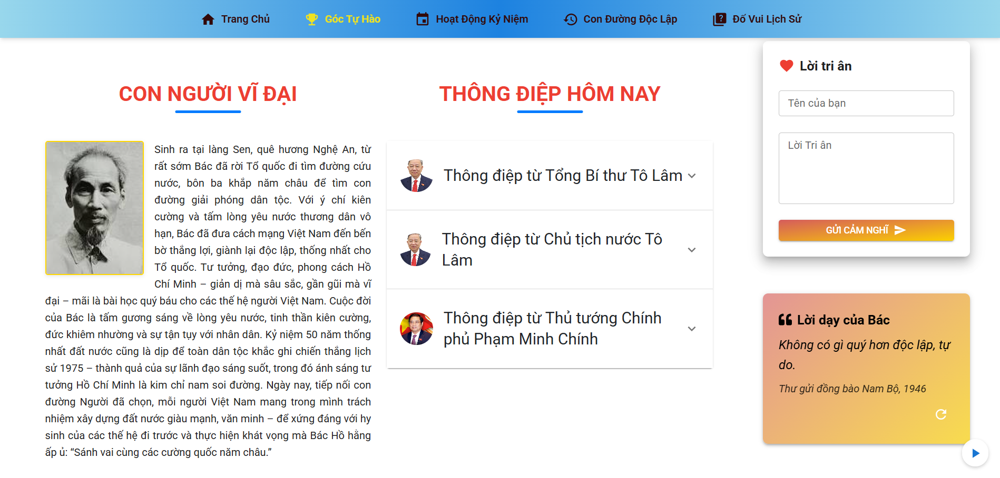

# 🇻🇳 Website Kỷ niệm 50 năm Giải phóng miền Nam và 135 năm ngày sinh Chủ tịch Hồ Chí Minh

🌐 **Link Website**: [https://ky-niem-135-ho-chi-minh-50-nam-giai.vercel.app](https://ky-niem-135-ho-chi-minh-50-nam-giai.vercel.app)

---

## 📸 Giao diện

### Trang Chủ

### Góc Tự Hào

### Hoạt động kỷ niệm

### Con đường độc lập

### Đố vui lịch sử

---

## ✨ Tính năng nổi bật

| Tính năng               | Mô tả                                                                                     |
|------------------------|--------------------------------------------------------------------------------------------|
| 🎨 Giao diện           | Thiết kế hiện đại, responsive trên mọi thiết bị (Mobile, Tablet, Desktop)                |
| 📸 Trình chiếu         | Slider hình ảnh và video tư liệu lịch sử với hiệu ứng chuyển động mượt mà                |
| 📅 Timeline            | Các mốc thời gian quan trọng trong cuộc đời Bác Hồ và lịch sử giải phóng miền Nam       |
| 🎵 Âm thanh            | Nhạc nền và âm thanh tư liệu lịch sử, có thể bật/tắt dễ dàng                            |
| 🎮 Tương tác           | Modal chi tiết sự kiện, hiệu ứng chuyển động với Framer Motion                          |
| 🔍 Đố vui lịch sử      | Trắc nghiệm lịch sử, tính điểm, lưu điểm vào LocalStorage                               |
| 📝 Góp ý               | Form gửi lời chúc và góp ý, hiển thị dạng slider tự động                                 |
| 🌐 Đa ngôn ngữ         | Hỗ trợ tiếng Việt và tiếng Anh                                                            |

---

## 🛠️ Công nghệ sử dụng

- **Frontend Framework**: React JS
- **UI Framework**: Material-UI (MUI), Tailwind CSS
- **Animation Library**: Framer Motion
- **Carousel**: React Slick
- **Build Tool**: Vite
- **Package Manager**: npm
- **Version Control**: Git
- **Deploy**: Vercel

---

## 👨‍💻 Tác giả

- **Họ và tên**: Nguyễn Văn Thành Đại  
- **Mã sinh viên**: 3123411062  
- **Lớp**: DCT123C2  
- **GitHub**: [ThanhDai2005](https://github.com/ThanhDai2005)

---

> 🕊️ Website được thực hiện nhằm tôn vinh giá trị lịch sử dân tộc và thể hiện lòng tri ân các thế hệ đi trước.  
> 💖 Cảm ơn bạn đã ghé thăm!
